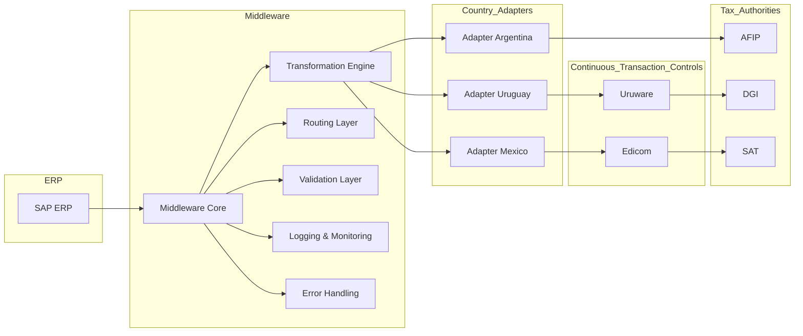

# Tax Middleware Architecture (Multi-Country)

## Overview

Este proyecto describe una arquitectura de middleware diseñada para integrar sistemas empresariales con organismos tributarios en distintos países, concectando con diferentes entes homologados.

Basado en experiencia real liderando implementaciones en entornos internacionales, el objetivo es definir una solución escalable, desacoplada y adaptable a múltiples regulaciones fiscales.

---

## Problem

Las empresas que operan en múltiples países enfrentan:

- Diferentes regulaciones tributarias
- Integraciones específicas por país
- Cambios frecuentes en normativas
- Alta complejidad de mantenimiento

---

## Solution

Se propone una arquitectura de middleware con las siguientes características:

- Desacoplamiento entre ERP (SAP) y organismos externos
- Capacidad de adaptación por país
- Escalabilidad horizontal
- Reutilización de componentes

---

## Architecture (Conceptual)

## Country Flows

- AR Argentina (AFIP): [Ver flujo](docs/argentina-flow.md)
- UY Uruguay (DGI): Próximamente
- MX México (SAT): Próximamente
  
## Key Components

- Adapter por país
- Motor de transformación de datos
- Gestor de errores centralizado
- Logging y monitoreo
- API Gateway (opcional)

---

## Benefits

- Reducción de impacto ante cambios regulatorios
- Mayor reutilización de código
- Mejora en la trazabilidad
- Escalabilidad para nuevos países

---

## Author

Daniel Escobar  
SAP Technical Lead – ABAP | Integraciones | Arquitectura
